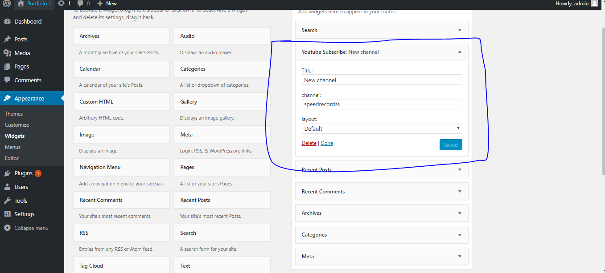
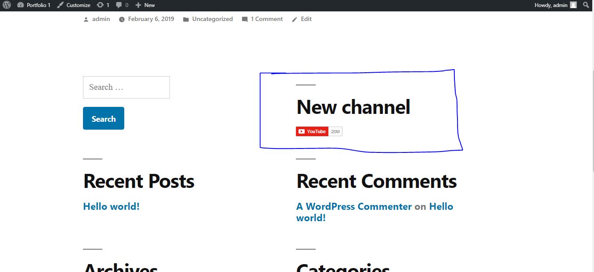
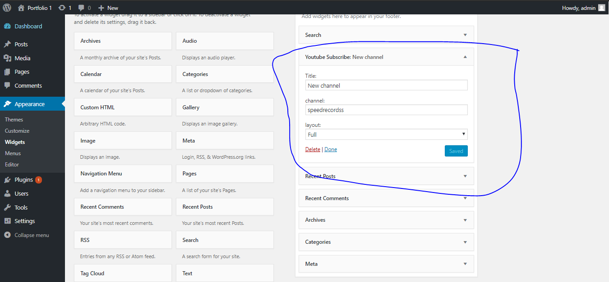
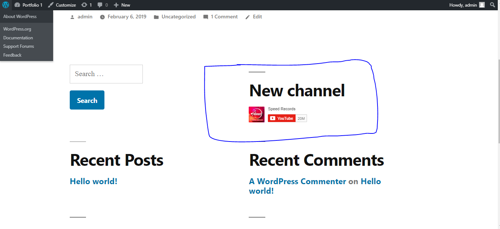

# Youtube-plugin

**Version 1.0.0**

This plugin can show Subscribe button in widgets area.This is First Plugin that i made.

This Plugin shows in Widget Area you can name any Youtube Channel Name and it will fetch it Subscribe Button also have a option to change its Layout it is on Default but you can change it into Full Layout.
  

**On Default Layout**
  

**On Default Layout**
  

**On Default Layout**
  

## License & Copyright

@ devlobb, Next Generation Company
